# webtrees module hh_clippings_cart_enhanced

!!! This is an alpha version! Do not use it in a productive webtrees system! !!!

This [webtrees](https://www.webtrees.net/) custom module replaces the original 'Clippings Cart' module.
It offers additional possibilities to add records to the clippings cart
and adds beside the possibility to export a GEDCOM zip-file the possibility
to visualize the records in the clippings cart using a diagram.

## Contents
This Readme contains the following main sections

* [Description](#description)
* [Screenshots](#screenshots)
* [Requirements](#requirements)
* [Installation](#installation)
* [Upgrade](#upgrade)
* [Translation](#translation)
* [Contact Support](#support)
* [Thank you](#thanks)
* [License](#license)

## Description

This custom module replaces the original 'Clippings Cart' module.
The design concept for the enhanced clippings cart is shown in the following diagram:

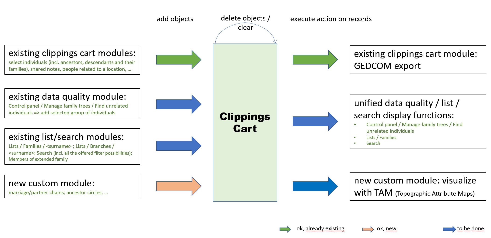

Various functions can collect records in the clippings cart and these records could then be passed on to various evaluation / export / visualization functions.
The user of the module can decide which records should be sent to the clippings cart
and which action should be executed on these records.

As input functions there are
* the functions of the current module "clippings cart" or the existing custom [Vesta clippings cart](https://github.com/vesta-webtrees-2-custom-modules/vesta_clippings_cart) module, which offer the possibility to put records in the clippings cart for a person or another GEDCOM object like a source or a note.
This includes for a person for example their ancestors or descendants,
possibly with their families. For a location it includes for example all persons with reference to this place.
* the search in the control panel for unconnected persons in a tree (with a new button "send to clippings cart") (tbd)
* the normal webtrees search (also with a button "send to clippings cart"), so that you can search for anything you want and with the option of using all the filter functions that are currently offered (tbd)
* the list display modules "Families" and "Family branches", so that you can send all persons with the same family name or all persons from a clan to the clippings cart (tbd)
* new functions in this module searching for marriage chains or ancestor circles in the tree.

The user can then delete selected records or groups of records of the same type
in the clippings cart or delete the clippings cart completely.

An action initiated by the user then takes place on the records in the clippings cart, such as
* the export to a GEDCOM zip file, as in the actual clippings cart module
* the display of the objects in list form with the possibility of sorting and filtering this list (tbd)
* the transfer of the records in the clippings cart to new functions that visualize this data or analyze it statistically.
Such a function could be for example a link-node-diagram like
[TAM](https://github.com/rpreiner/tam) (Topographic Attribute Map) or [Lineage](https://github.com/huhwt/lineage).

## Screenshots

### Screenshots of menus
#### Screenshot of the new menu

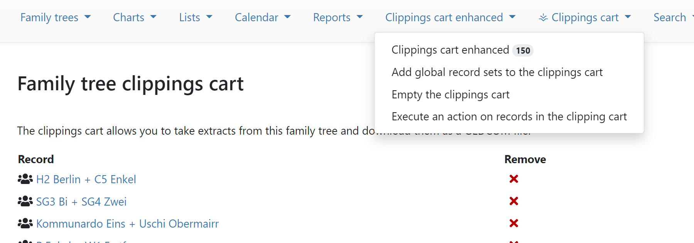

#### Screenshot of menu to add global sets of records for a tree

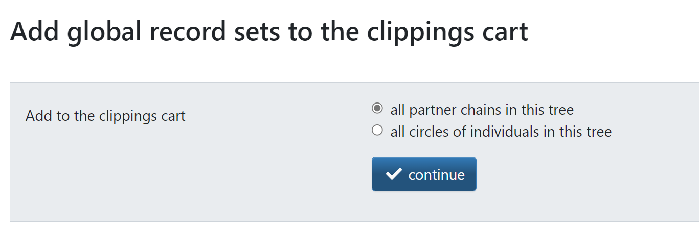

#### Screenshot of new menu to delete records in the clippings cart

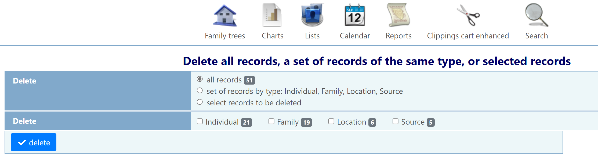

#### Screenshot of new menu to execute actions on the records in the clippings cart

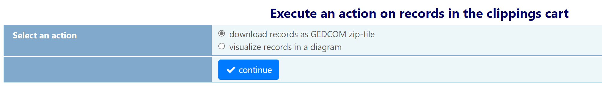

### Screenshots of new visualisation possibilities
The following charts are produced by an external application TAM.
It is planned to integrate TAM into webtrees
so that export/import is not any longer necessary.

#### Screenshot using TAM for a tree with more than 10.000 persons

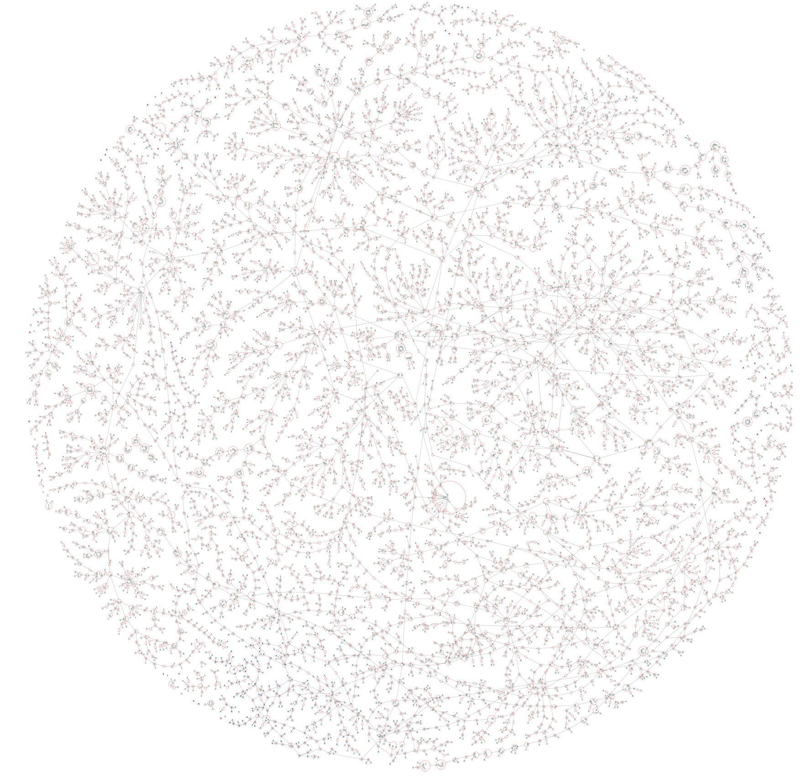

This image was produced by exporting a complete tree from webtrees as GEDCOM file
using the administrator menu. Then this file was imported to TAM.
It is planned to add a new option "add all records to the clippings cart"
to the "global add menu" of this module.

#### Screenshot using TAM for a visualisation of all ancestor circles in this tree

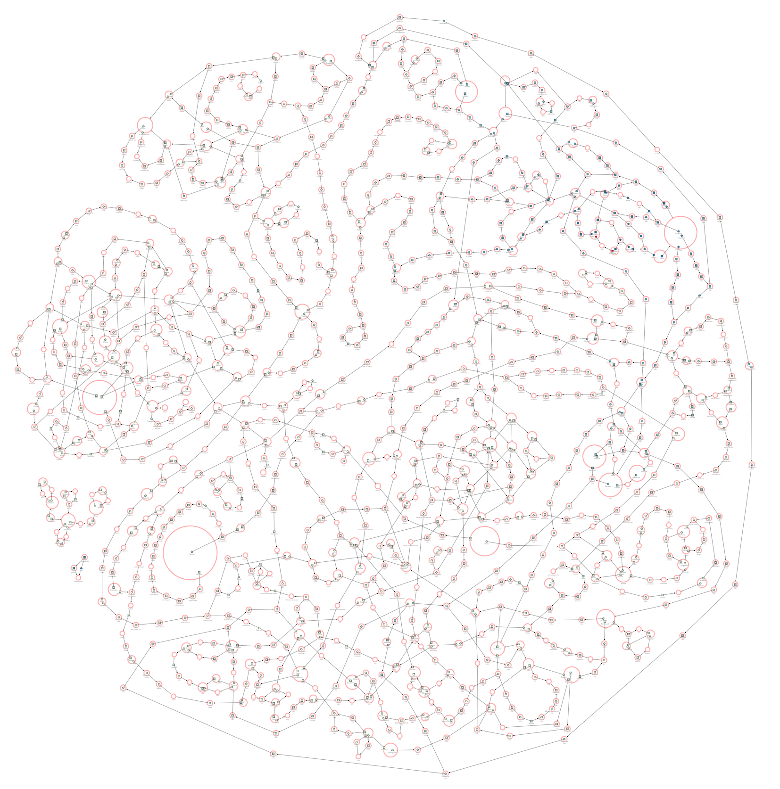

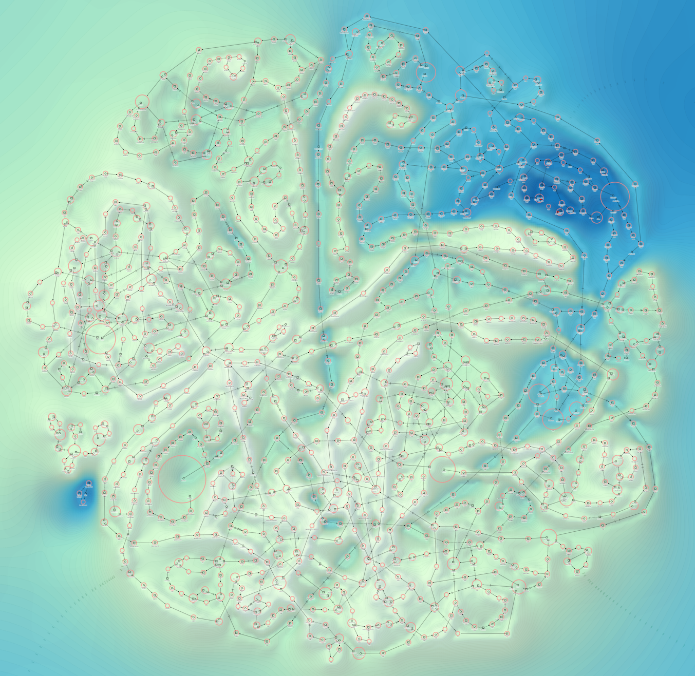

This chart was produced using the new "global add menu"
selecting "add all circles".
This function removes all leaves in a tree recursively.
A family with two parents and her child is a trivial circle
(child -> mother -> husband -> child) and is therefore not included.
Circles are a result for example when cousins are married together.
Such circles are responsible for pedigree collapse
(in German: Ahnenschwund or Implex). 
Following the connections of marriage or partnership, circles can be found 
if two families are interconnected by more than one marriage.
Maybe such circles can have a length of 30, 40, or 50 steps.
They can connect several families together and it is not easy to find them.
Such long distant connections in a tree are interconnecting different parts
of a family.
I call them therefore sometimes "ancestor Autobahn".
The first Autobahn I built in my tree, many years ago,
was connection to Johann Wolfgang von Goethe in more than 50 steps.

For example my parents are connected together by several such circles
(beside the trivial connection by their own marriage).
In webtrees you can search for such connections by using
Charts / Relationships / Find all possible relationships.
But up to now there was no possibility to show all such circles in a tree.

### Screenshot using TAM to show a H diagram

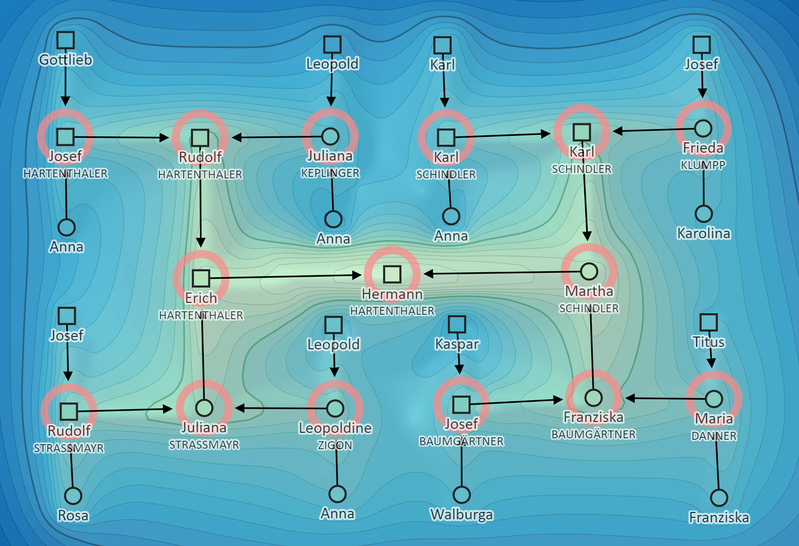

A H diagramm is a very compact ancestor diagram showing the proband and
a few generations of his ancestors.
One example is the webtrees chart "compact tree".
To produce such a diagram using TAM, you have to select the proband,
add 3, 4, or 5 generations of his ancestors to the clippings cart. Then use the action menu
and export these records using the TAM option.
Then import the produced GEDCOM file to your TAM application.
Now you have to place the persons and families
manually to their right position by drag and drop.

#### Screenshot using TAM for a partner chain with 30 partners of partners of partners ...

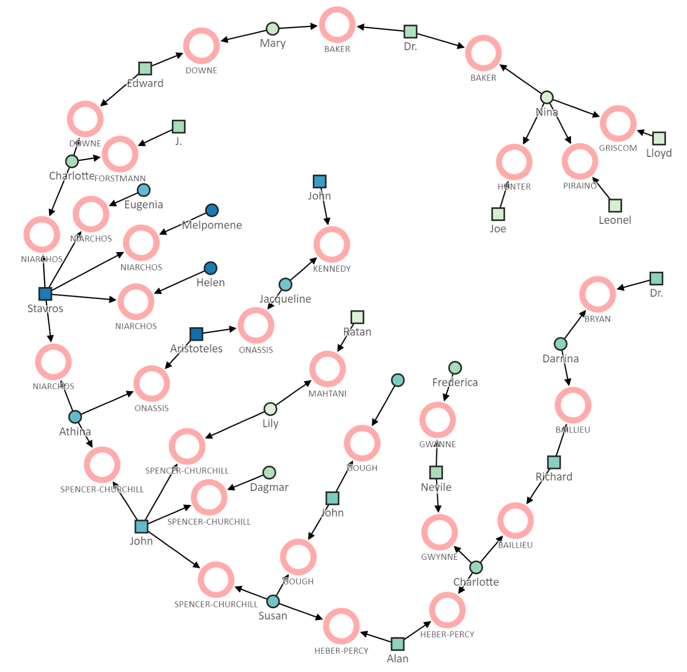

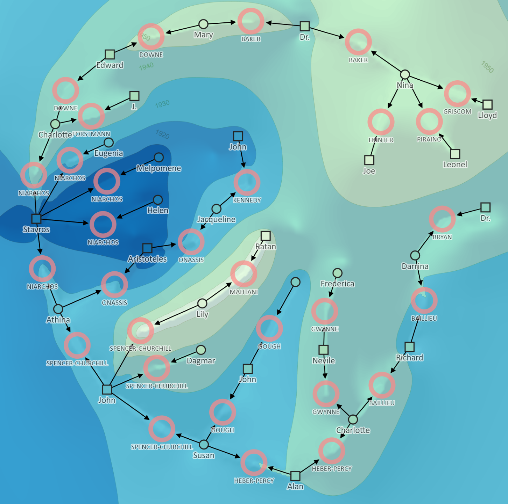

A partner chain is a chain of partners of partners of partners of ...
If one partner of marriage was married before or later to another partner,
this is a chain of three partners.
Trivial chains consisting only of two partners (husband/wife) are ignored.
Maybe one of the partners was married three or more times, then the chain becomes
a tree of chains.
There was up to now no possibility in webtrees to visualize such
trees of partner chains.

## Requirements

This module requires **webtrees** version 2.0 or later.
This module has the same requirements as [webtrees#system-requirements](https://github.com/fisharebest/webtrees#system-requirements).

This module was tested with **webtrees** 2.0.17 version and all available themes and all other custom modules.
If you are using the Vesta clippings cart module: the integration is an open issue.

## Installation

This section documents installation instructions for this module.

1. Download the [latest release](https://github.com/hartenthaler/hh_clippings_cart_enhanced/releases/latest).
3. Unzip the package into your `webtrees/modules_v4` directory of your web server.
4. Rename the folder to `hh_clippings_cart_enhanced`. It's safe to overwrite the respective directory if it already exists.
5. Login to **webtrees** as administrator, go to Control Panel/Modules/Genealogy/Menus,
   and find the module. It will be called "Clippings cart enhanced". Check if it has a tick for "Enabled".
6. Edit this entry to set the access level for each tree and to position the menu item to suit your preferences.
7. You can deactivate the standard module "clippings cart".
8. Finally, click SAVE, to complete the configuration.

## Upgrade

To update simply replace the hh_clippings_cart_enhanced files
with the new ones from the latest release.

## Translation

You can help to translate this module.
It uses the po/mo system.
You can contribute via a pull request (if you know how) or by e-mail.
Updated translations will be included in the next release of this module.

There are now, beside English and German, no other translations available.

## Support

Issues: you can report errors raising an issue in this GitHub repository.

Forum: general webtrees support can be found at the [webtrees forum](http://www.webtrees.net/)

## Thank you

Special thanks to [huhwt](https://github.com/huhwt/) for testing, suggestions, and contributions.

## License

This module is derived from the [Vesta clippings cart](https://github.com/vesta-webtrees-2-custom-modules/vesta_clippings_cart) module.

* Copyright (C) 2021 Hermann Hartenthaler
* Copyright (C) 2021 Richard Cissée. All rights reserved.
* Derived from **webtrees** - Copyright 2021 webtrees development team.

This program is free software: you can redistribute it and/or modify
it under the terms of the GNU General Public License as published by
the Free Software Foundation, either version 3 of the License, or
(at your option) any later version.

This program is distributed in the hope that it will be useful,
but WITHOUT ANY WARRANTY; without even the implied warranty of
MERCHANTABILITY or FITNESS FOR A PARTICULAR PURPOSE. See the
GNU General Public License for more details.

You should have received a copy of the GNU General Public License
along with this program. If not, see <http://www.gnu.org/licenses/>.

* * *
